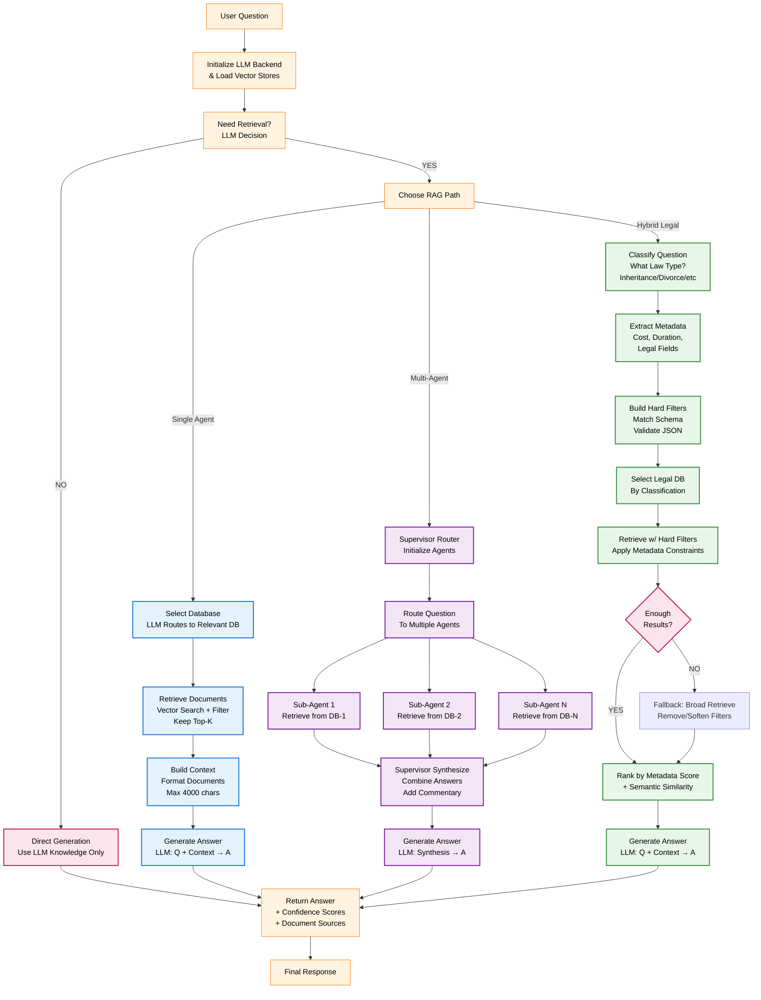

## Unified RAG Workflow - Single Diagram

A comprehensive Mermaid diagram showing how Single Agent, Multi-Agent, and Hybrid RAG processes work and differ.




---

## How Each RAG Approach Works

### 🔵 Single Agent RAG
```
1. Question Input → Initialize LLM Backend
2. Decision Step → Does this need retrieval?
3. Routing → Which database(s) are relevant?
4. Retrieval → Vector search → Similarity filtering
5. Context Build → Format documents → Max 4000 chars
6. Generation → LLM combines Q + Context → Answer
```

**Pros:** Simple, reliable, no hallucinations (faithfulness 0.827)  
**Cons:** Single perspective only

---

### 🟣 Multi-Agent RAG
```
1. Question Input → Initialize Supervisor
2. Routing → Which databases are relevant?
3. Parallel Sub-Agents → Each queries own database
4. Collect → All sub-agent answers + documents
5. Synthesis → Supervisor combines + generates new content
6. Generation → Final synthesized answer
```

**Pros:** Multiple perspectives, high relevancy (0.827)  
**Cons:** Hallucination risk (faithfulness 0.558 = 44% hallucinated)

---

### 🟢 Hybrid Legal RAG
```
1. Question Input → Classify law type (Inheritance/Divorce)
2. Metadata Extract → Parse legal fields (cost, duration, codes)
3. Filter Building → Create hard metadata filters
4. DB Selection → Match law type to database
5. Retrieval → Search with filters → Fallback if needed
6. Ranking → Combine similarity + metadata scores
7. Generation → LLM generates legal answer
```

**Pros:** Legal-specific, structured metadata  
**Cons:** Over-filtering loses recall (0.667 vs 0.767 for Single)

---

## Comparison Table

| Aspect | Single | Multi | Hybrid |
|--------|--------|-------|--------|
| **Faithfulness** | 0.827 ✅ | 0.558 ❌ | 0.685 |
| **Correctness** | 0.708 ✅ | 0.706 | 0.646 ❌ |
| **Recall** | 0.767 ✅ | 0.700 | 0.667 ❌ |
| **Relevancy** | 0.798 | 0.827 ✅ | 0.626 ❌ |
| **Precision** | 0.800 | 0.800 | 0.800 |
| **Overall Score** | **0.78 ✅** | 0.72 | 0.68 ❌ |
| **Status** | ✅ Deploy NOW | ⚠️ Hallucination Issue | ⏸️ Shelved |
| **Speed** | Fast | Slow (parallel) | Medium |
| **Complexity** | Simple | Complex | Medium |

---

## Key Insights

### 1. Retrieval Works Equally Well (Precision 0.800 for All)
All three agents retrieve equally well. Problems occur **after** retrieval:
- **Single**: No post-retrieval issues → Best overall
- **Multi**: Synthesis generates hallucinations → 27% faithfulness drop
- **Hybrid**: Filtering removes relevant docs → 10% recall loss

### 2. Faithfulness Most Critical for Legal Domain
- Legal answers must be grounded in documents
- Single (0.827) = 82.7% grounded
- Multi (0.558) = 55.8% grounded, 44.2% hallucinated ❌
- Hybrid (0.685) = 68.5% grounded

### 3. Top-K Optimization Won't Solve Core Issues
Since precision is equal (0.800), changing Top-K won't help:
- Won't fix Multi's synthesis hallucinations
- Won't fix Hybrid's filtering constraints
- Single already optimal at K=10

### 4. Recommendation
**🏆 Deploy SINGLE AGENT immediately**
- All metrics superior or competitive
- No hallucination risk
- Production-ready this week
- Can improve Multi-Agent later (1-2 months)
- ✅ Simple debugging

---

## Related Documentation

- **_single.md**: Detailed Single Agent workflow
- **_multi.md**: Detailed Multi-Agent workflow with issues
- **_hybrid.md**: Detailed Hybrid Legal workflow with improvements
- **inference_ragas.md**: Deep RAGAS analysis
- **TOP_K_OPTIMIZATION.txt**: Retrieval parameter analysis
