## Full RAG Workflow - Combined Mermaid Diagram

This file contains three Mermaid workflow diagrams showing all RAG process flows side-by-side and integrated.

---

### RAG Workflow Comparison Diagram


---

### Detailed Single-Agent RAG Flow


---

### Detailed Multi-Agent RAG Flow


---

### Detailed Hybrid Legal RAG Flow

```mermaid
flowchart TD
    subgraph law_class ["LAW CLASSIFICATION"]
        A["📥 User Question"] --> B["Stage 1: Heuristic Keywords"]
        B --> C{Clear Match?}
        C -->|YES| D["Return law Type"]
        C -->|NO| E["Stage 2: LLM Classification"]
        E --> D
        D --> F["law ∈ {Inheritance, Divorce}"]
    end

    subgraph meta_extract ["METADATA EXTRACTION"]
        F --> G["Load LEGAL_METADATA_SCHEMA"]
        G --> H["LLM Extract Metadata"]
        H --> I["Parse JSON Response"]
        I --> J["Validate Schema"]
        J --> K["meta Dict<br/>law, cost, duration,<br/>codes, succession_type, ..."]
    end

    subgraph filter_build ["FILTER & DB SELECTION"]
        K --> L["Build Metadata Filter"]
        L --> M["Mandatory: law"]
        M --> N["Optional: civil_codes[0]"]
        N --> O["filter = {law, codes}"]
        O --> P["Heuristic DB Selection"]
        P --> Q["Match law to DB names"]
        Q --> R["candidate_dbs"]
    end

    subgraph retrieval ["RETRIEVAL WITH FALLBACK"]
        R --> S["DB Discovery"]
        S --> T["Analyze DB Descriptions"]
        T --> U["Phase 1: Full Filter"]
        U --> V["Apply full_filter"]
        V --> W["Vector Search k_base"]
        W --> X["Get raw_docs"]
        X --> Y{len docs ≥ top_k?}
        Y -->|YES| Z["Use Full Results"]
        Y -->|NO| AA["Phase 2: Mandatory Fallback"]
        AA --> AB["Apply law filter ONLY"]
        AB --> AC["Vector Search k_base"]
        AC --> AD["Get fallback_docs"]
    end

    subgraph ranking ["RANKING & FILTERING"]
        Z --> AE["Similarity Ranking"]
        AD --> AE
        AE --> AF["Calculate Cosine Similarity"]
        AF --> AG["Filter ≥ 0.1 threshold"]
        AG --> AH["Optional Re-ranking<br/>metadata × relevance"]
        AH --> AI["Top-K Documents"]
    end

    subgraph context ["CONTEXT BUILDING"]
        AI --> AJ["Format with Sources"]
        AJ --> AK["Include Law Metadata"]
        AK --> AL["Max 4000 Characters"]
    end

    subgraph generation ["ANSWER GENERATION"]
        AL --> AM["Add Legal Context"]
        AM --> AN["LLM with Legal Awareness"]
        AN --> AO["Generate Legal Answer"]
    end

    subgraph output ["OUTPUT & TRACE"]
        AO --> AP{show_reasoning?}
        AP -->|YES| AQ["Build Trace:<br/>Law Classification Log<br/>Metadata Extraction<br/>Filter Applied<br/>Fallback Status<br/>Retrieval Stats"]
        AP -->|NO| AR["Skip Trace"]
        AQ --> AS["Return Answer+Docs"]
        AR --> AS
    end

    style law_class fill:#ffe0b2
    style meta_extract fill:#ffe0b2
    style filter_build fill:#ffccbc
    style retrieval fill:#ffccbc
    style ranking fill:#ffab91
    style context fill:#ff8a65
    style generation fill:#ff7043
    style output fill:#e8f5e9
```



---

### Complete RAG Architecture: Three Approaches in One View

```mermaid
graph TB
    Input["📥 User Question"]
    
    Input --> Decision{"Choose RAG Type"}
    
    Decision -->|Simple & Fast| SinglePath["🔵 SINGLE AGENT"]
    Decision -->|Multi-Domain| MultiPath["🟣 MULTI-AGENT"]
    Decision -->|Legal Specialized| HybridPath["🟢 HYBRID"]
    
    subgraph SingleAgent ["SINGLE AGENT WORKFLOW"]
        S1["Need Retrieval?"]
        S2["Select Relevant DB"]
        S3["Vector Search"]
        S4["Similarity Filter"]
        S5["Build Context"]
        S6["Generate Answer"]
        S1 --> S2
        S2 --> S3
        S3 --> S4
        S4 --> S5
        S5 --> S6
    end
    
    subgraph MultiAgent ["MULTI-AGENT WORKFLOW"]
        M1["Supervisor Initialize"]
        M2["Route to Multiple DBs"]
        M3["Parallel Sub-Agents"]
        M4["Collect Sub-Answers"]
        M5["Supervisor Synthesis"]
        M6["Generate Unified Answer"]
        M1 --> M2
        M2 --> M3
        M3 --> M4
        M4 --> M5
        M5 --> M6
    end
    
    subgraph HybridAgent ["HYBRID LEGAL WORKFLOW"]
        H1["Classify Law Type"]
        H2["Extract Metadata"]
        H3["Build Filters"]
        H4["Smart DB Selection"]
        H5["Retrieve w/ Filters"]
        H6["Fallback Logic"]
        H7["Rank & Generate"]
        H1 --> H2
        H2 --> H3
        H3 --> H4
        H4 --> H5
        H5 --> H6
        H6 --> H7
    end
    
    SinglePath --> SingleAgent
    MultiPath --> MultiAgent
    HybridPath --> HybridAgent
    
    SingleAgent --> Output["✅ FINAL ANSWER"]
    MultiAgent --> Output
    HybridAgent --> Output
    
    Output --> Evaluation{Evaluate Quality}
    
    Evaluation -->|Faithfulness| F["Single: 0.827 ✅<br/>Hybrid: 0.685<br/>Multi: 0.558 ❌"]
    Evaluation -->|Correctness| C["Single: 0.708 ✅<br/>Multi: 0.706<br/>Hybrid: 0.646"]
    Evaluation -->|Recall| R["Single: 0.767 ✅<br/>Multi: 0.700<br/>Hybrid: 0.667 ❌"]
    Evaluation -->|Relevancy| V["Multi: 0.827 ✅<br/>Single: 0.798<br/>Hybrid: 0.626"]
    
    F --> Recommendation["🏆 RECOMMENDED:<br/>Deploy SINGLE AGENT<br/>Best Faithfulness (0.827)<br/>Best Correctness (0.708)<br/>Best Recall (0.767)<br/>Production Ready NOW"]
    
    style Input fill:#e1f5ff
    style Decision fill:#fff9c4
    style Output fill:#c8e6c9
    style Recommendation fill:#a5d6a7
    style SingleAgent fill:#e3f2fd
    style MultiAgent fill:#f3e5f5
    style HybridAgent fill:#e8f5e9
```



---

### Data Flow: Question to Answer


---

### Process Comparison Matrix

```mermaid
graph TB
    subgraph comparison ["WORKFLOW COMPARISON"]
        direction LR
        
        subgraph sa ["SINGLE"]
            SA["Input"]
            SA --> "Decision Logic" --> "DB Routing" --> "Vector Search" --> "Similarity Filter" --> "Context Build" --> "LLM Generate"
        end
        
        subgraph ma ["MULTI-AGENT"]
            MA["Input"]
            MA --> "Supervisor Init" --> "Multi-Route" --> "Parallel Retrieval" --> "Collect Answers" --> "Supervisor Combine" --> "LLM Generate"
        end
        
        subgraph hy ["HYBRID"]
            HA["Input"]
            HA --> "Law Classification" --> "Metadata Extract" --> "Filter Building" --> "Smart DB Select" --> "Retrieve+Fallback" --> "LLM Generate"
        end
    end
    
    style sa fill:#e3f2fd
    style ma fill:#f3e5f5
    style hy fill:#e8f5e9
```

---

### Performance Radar: All Three RAG Approaches

```mermaid
graph TB
    Metrics["📊 RAGAS Metrics Comparison"]
    
    Metrics --> Chart["
    ╔════════════════════════════════════════════╗
    ║   METRIC        │ SINGLE  │ MULTI  │ HYBRID ║
    ╠════════════════════════════════════════════╣
    ║ Faithfulness    │ 0.827 ✅│ 0.558 ❌│ 0.685  ║
    ║ Correctness     │ 0.708 ✅│ 0.706  │ 0.646 ❌║
    ║ Context Recall  │ 0.767 ✅│ 0.700  │ 0.667 ❌║
    ║ Answer Relevancy│ 0.798  │ 0.827 ✅│ 0.626 ❌║
    ║ Precision       │ 0.800  │ 0.800  │ 0.800  ║
    ║ Overall Score   │ 0.78 ✅│ 0.72   │ 0.68 ❌║
    ╚════════════════════════════════════════════╝
    
    WINNER: SINGLE AGENT (0.78)
    - Highest Faithfulness (0.827)
    - Highest Correctness (0.708)
    - Highest Recall (0.767)
    - Production Ready NOW
    "]
    
    style Chart fill:#c8e6c9
```



---

## Key Insights

### 1. Architecture Choice Matters
- **Single**: Best for accuracy and reliability
- **Multi**: Best for relevancy but hallucination risk
- **Hybrid**: Specialized but filtering too strict

### 2. Faithfulness Critical for Legal
- Legal domain requires grounded answers
- Single (0.827) best choice
- Multi hallucinations (44%) unacceptable

### 3. Retrieval vs Synthesis Problem
- All agents retrieve equally well (precision 0.800)
- Problems occur POST-retrieval:
  - Multi: Synthesis adds hallucinations
  - Hybrid: Filtering removes relevant docs
  - Single: No issues

### 4. Recommendation
Deploy **SINGLE AGENT** immediately (this week)
- ✅ All metrics superior or competitive
- ✅ No hallucination risk
- ✅ Production ready
- ✅ Simple debugging

---

## Related Documentation

- **_single.md**: Detailed Single Agent workflow
- **_multi.md**: Detailed Multi-Agent workflow with issues
- **_hybrid.md**: Detailed Hybrid Legal workflow with improvements
- **inference_ragas.md**: Deep RAGAS analysis
- **TOP_K_OPTIMIZATION.txt**: Retrieval parameter analysis
