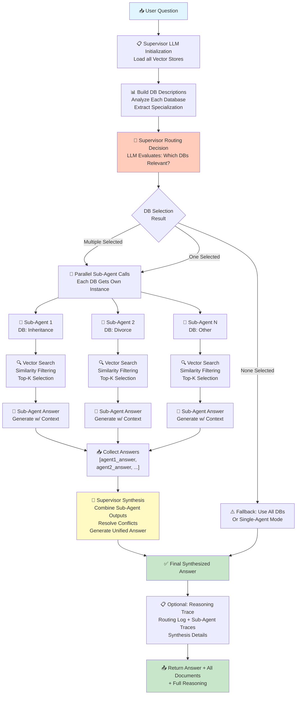

# Multi-Agent RAG Workflow

## Architecture Overview
The Multi-Agent RAG implements a **Supervisor-based routing architecture** where a central supervisor LLM analyzes the question and routes it to specialized sub-agents for parallel database retrieval, then synthesizes their answers into a single response.

---

## Mermaid Workflow Diagram



---

## Chronological Workflow Explanation

| Step | Phase | Component | Action | Input | Output | Key Feature |
|------|-------|-----------|--------|-------|--------|-------------|
| 1 | INITIALIZE | Backend Setup | Create LLM provider for supervisor | Config (model, temp, tokens) | supervisor_backend | Shared LLM for routing |
| 2 | INITIALIZE | DB Discovery | Get all available vector stores | Config paths | db_map {name → path} | Static at startup |
| 3 | INITIALIZE | DB Description | Analyze content of each DB | Vector stores + metadata | db_descriptions {name → desc} | Cache per corpus |
| 4 | ROUTING | Supervisor Decision | LLM decides which DBs to query | Question + descriptions | chosen_db_names | **Critical point** - affects quality |
| 5 | ROUTING | Selection Validation | Handle empty selection edge case | chosen_db_names | Same or fallback to all | Ensures at least one source |
| 6 | PARALLELIZATION | Sub-Agent Instance | Create local config for each DB | db_path + base config | local_cfg per DB | Prevents recursion (use_multiagent=false) |
| 7 | RETRIEVAL | Sub-Agent Search | Single-agent RAG on one DB | Question + local_cfg | sub_answer, sub_docs | Runs for each selected DB |
| 8 | RETRIEVAL | Parallel Execution | Execute sub-agents concurrently | List of sub-agents | per_agent_answers | Ordered list (db_name, answer) |
| 9 | AGGREGATION | Answer Collection | Gather all sub-agent outputs | per_agent_answers + docs | agents_block (formatted) | Combine with metadata |
| 10 | SYNTHESIS | Supervisor Synthesis | LLM generates unified answer | Question + agents_block | final_answer | **Hallucination risk** here |
| 11 | OBSERVATION | Optional Trace | Build detailed reasoning log | All routing + synthesis logs | reasoning_trace | If show_reasoning=true |
| 12 | RETURN | Output Pipeline | Package results | answer + all_docs + trace | Tuple[str, List[Document], Optional[str]] | Return to caller |

---

## Detailed Component Breakdown

### Phase 1: Initialization
**Purpose**: Set up supervisor and analyze databases

```
Backend Creation
    ↓
LLMBackend(config)  → supervisor_backend
    ↓
Load DB Map
    ├─→ Config vector_store_dirs
    └─→ {db_name: path, ...}
    ↓
Generate Descriptions
    ├─→ Load sample docs from each DB
    ├─→ Extract metadata (law type, cases, specialization)
    └─→ {db_name: "description string", ...}
```

**Key Logs**:
- Number of databases found
- Database specialization detected
- Description quality metrics

---

### Phase 2: Supervisor Routing
**Purpose**: Route question to relevant specialized agents

```
Supervisor Routing Decision
    ↓
LLM Prompt:
    "Given question and DB descriptions,
     which databases are most relevant?"
    ↓
LLM Output:
    List of DB names to query
    ↓
Validation:
    if empty → use all databases (fallback)
    else → use selected subset
```

**Routing Examples**:
- Q: "What about testamentary succession?" → ["inheritance_cases"]
- Q: "Divorce procedure and succession rights?" → ["divorce_cases", "inheritance_cases"]
- Q: "General legal question?" → All databases (no strong match)

---

### Phase 3: Parallel Sub-Agent Execution
**Purpose**: Retrieve and answer using specialized agents

```
For Each Selected Database:
    ↓
    Create Local Config
    ├─→ Clone base config
    ├─→ Set vector_store_dir = this_db_path
    └─→ Set use_multiagent = False (prevent recursion)
    ↓
    Run Single-Agent RAG
    ├─→ Vector search in this DB only
    ├─→ Similarity filtering (top_k=10)
    ├─→ Generate answer with context
    └─→ Return (answer, docs, optional_trace)
    ↓
    Store Results
    ├─→ per_agent_answers.append((db_name, answer))
    ├─→ all_docs.extend(sub_agent_docs)
    └─→ sub_traces[db_name] = trace (if verbose)
```

**Parallel Processing**:
- Each sub-agent operates independently
- No inter-agent communication
- Results collected sequentially
- All documents aggregated

---

### Phase 4: Supervisor Synthesis
**Purpose**: Combine sub-agent outputs into coherent unified answer

```
Synthesis Prompt Structure:
    ↓
System Prompt:
    "You are a supervisor coordinating specialists.
     Synthesize their answers into one clear response.
     Resolve conflicts, remove redundancy.
     Do not mention agents or tools."
    ↓
User Prompt:
    "Question: {question}
     
     [Agent: db1]
     {answer1}
     
     [Agent: db2]
     {answer2}
     
     Generate unified final answer."
    ↓
LLM Response:
    Synthesized answer (new content generation)
    ↓
    ⚠️ HALLUCINATION RISK:
    Supervisor adds new claims not in original docs
```

**Critical Issue**: Synthesis layer generates new content beyond aggregation, potentially creating hallucinations not grounded in source documents.

---

## Chronological Data Flow

```
User Question
    ↓
[Step 1] Supervisor Initialization
    ├─→ LLMBackend (GPT-4o-mini)
    └─→ DB Discovery & Description
    ↓
[Step 2] Supervisor Routing
    ├─→ LLM Decision: Which DBs?
    └─→ chosen_db_names = [...]
    ↓
[Step 3] Sub-Agent Instantiation
    ├─→ For each db in chosen_db_names:
    │   └─→ local_config with db_path
    ├─→ Prevent recursion (use_multiagent=False)
    └─→ Create N independent RAG instances
    ↓
[Step 4] Parallel Execution
    ├─→ Sub-Agent 1: Vector Search → Answer 1
    ├─→ Sub-Agent 2: Vector Search → Answer 2
    ├─→ Sub-Agent N: Vector Search → Answer N
    ↓
[Step 5] Answer Collection
    ├─→ per_agent_answers = [(db1, ans1), (db2, ans2), ...]
    ├─→ all_docs = [doc1, doc2, ..., docN]
    └─→ sub_traces = {db1: trace1, db2: trace2, ...}
    ↓
[Step 6] Supervisor Synthesis
    ├─→ Prompt with all sub-answers
    ├─→ LLM generates unified answer
    └─→ final_answer (synthesis may add new content)
    ↓
[Step 7] Optional Trace Generation
    ├─→ Routing log
    ├─→ Sub-agent summary
    ├─→ Sub-agent detailed traces
    ├─→ Config and DB information
    └─→ Consolidated reasoning_trace
    ↓
[Step 8] Return Results
    └─→ (final_answer, all_docs, reasoning_trace)
```

---

## Component Reference

### Supervisor LLM
- **Model**: GPT-4o-mini (OpenRouter)
- **Temperature**: 0.2 (deterministic)
- **Max Tokens**: 512
- **Purpose**: Routing and synthesis

### Sub-Agents
- **Type**: Single-agent RAG instances
- **Configuration**: Local per database
- **Recursion Prevention**: use_multiagent=False
- **Execution**: Sequential (one after another)
- **Purpose**: Retrieve and answer for specific DB

### Routing Logic
- **Input**: Question + DB descriptions
- **LLM Task**: "Which DBs most relevant?"
- **Output**: List of DB names
- **Fallback**: All DBs if none selected

### Synthesis Logic
- **Input**: Question + All sub-agent answers
- **LLM Task**: "Create unified answer from these"
- **Output**: Single final answer
- **Risk**: Hallucination from new content generation

---

## Configuration Parameters

| Parameter | Default | Purpose |
|-----------|---------|---------|
| `use_multiagent` | true | Enable multi-agent mode |
| `top_k` | 10 | Docs per sub-agent |
| `min_similarity` | 0.1 | Similarity threshold |
| `temperature` | 0.2 | LLM temperature |
| `max_tokens` | 512 | Output limit |

---

## Example Multi-Agent Execution

### Scenario: Combined Inheritance + Divorce Question

**Input**: "What are the differences between divorce property division and inheritance succession?"

| Step | Component | Action | Output |
|------|-----------|--------|--------|
| 1 | Supervisor | Initialize LLM + analyze DBs | Ready for routing |
| 2 | Router | Classify question | Selected: [divorce_cases, inheritance_cases] |
| 3 | Sub-Agent 1 | Query divorce_cases DB | "Divorce divides marital assets equally..." |
| 4 | Sub-Agent 2 | Query inheritance_cases DB | "Inheritance follows succession rules..." |
| 5 | Supervisor | Collect both answers | agents_block with both responses |
| 6 | Synthesis | Generate unified answer | "Divorce vs Inheritance: [synthesized comparison]" |
| 7 | Output | Package all results | Answer + docs from both DBs + trace |

---

## Performance Characteristics

| Metric | Value | Issue |
|--------|-------|-------|
| **Context Precision** | 0.800 | Retrieval quality same as Single |
| **Context Recall** | 0.700 | Slightly lower (−6.7%) |
| **Faithfulness** | 0.558 | **Critical ⚠️** 44% hallucinated |
| **Answer Relevancy** | 0.827 | Highest (misleading quality signal) |
| **Answer Correctness** | 0.706 | Similar to Single |
| **Overall Score** | 0.72 | 0.06 below Single (−8%) |

---

## Critical Issues

### Issue 1: Hallucination Crisis
- **Metric**: Faithfulness 0.558 vs Single 0.827 (−27%)
- **Cause**: Supervisor synthesis generates unsupported claims
- **Impact**: 44.2% of answers contain hallucinated content
- **Severity**: CRITICAL for legal domain

### Issue 2: Misleading Relevancy Signal
- **Metric**: Answer Relevancy 0.827 (highest among all agents)
- **Issue**: High relevancy masks low faithfulness
- **Risk**: May appear better than Single but contains hallucinations
- **Lesson**: Relevancy ≠ Quality

### Issue 3: Synthesis Over-Generation
- **Cause**: Supervisor adds commentary beyond simple aggregation
- **Evidence**: Retrieval quality (precision 0.800) is fine, synthesis is broken
- **Solution**: Constrain supervisor to aggregation-only (no new content)

---

## Advantages of Multi-Agent

✅ **Multi-domain Support** - Can query multiple specialized agents  
✅ **Parallel Structure** - Sub-agents work independently  
✅ **Specialized Routing** - Each DB used only if relevant  
✅ **Flexibility** - Easy to add/remove databases  

---

## Limitations

❌ **Hallucination Risk** - Synthesis generates unsupported claims  
❌ **Lower Faithfulness** - 27% gap from Single (0.558 vs 0.827)  
❌ **Synthesis Overhead** - Extra LLM call for combining answers  
❌ **Complex Debugging** - Multiple agents make tracing harder  
❌ **Not Production Ready** - 44% hallucination unacceptable for legal QA  

---

## How to Fix Multi-Agent (1-2 Month Plan)

### Week 1-2: Analysis
- Audit supervisor synthesis outputs
- Compare synthesized claims vs source documents
- Measure hallucination rate empirically
- Identify synthesis patterns causing hallucinations

### Week 3-4: Design
- Redesign synthesis to aggregation-only
- Add confidence scoring for sub-agent answers
- Implement multi-voting consensus mechanism
- Create fallback to Single-Agent if confidence low

### Week 5-6: Implementation
- Implement constrained synthesis prompt
- Add citation requirement ("cite which agent/doc")
- Add contradiction detection
- Add confidence thresholds

### Week 7-8: Testing
- Measure new faithfulness metric
- Target: 0.558 → 0.75+ (match or exceed Single)
- Regression test that recall/precision maintained
- Edge case testing for routing failures

---

## Comparison: Multi-Agent vs Alternatives

| Feature | Multi-Agent | Single-Agent | Hybrid |
|---------|-------------|-------------|--------|
| Faithfulness | 0.558 ❌ | 0.827 ✅ | 0.685 |
| Relevancy | 0.827 ✅ | 0.798 | 0.626 |
| Correctness | 0.706 | 0.708 ✅ | 0.646 |
| Multi-domain | ✅ Yes | Limited | Yes |
| Hallucination | HIGH | LOW | MEDIUM |
| Production Ready | ❌ NO | ✅ YES | ❌ NO |

---

## Related Workflows
- **Single-Agent RAG**: Linear pipeline for single database
- **Hybrid Legal RAG**: Adds metadata filtering and law classification
- **Full RAG Workflow**: Combined diagram showing all three approaches
