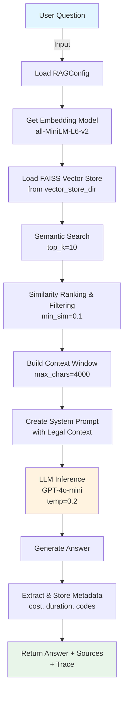
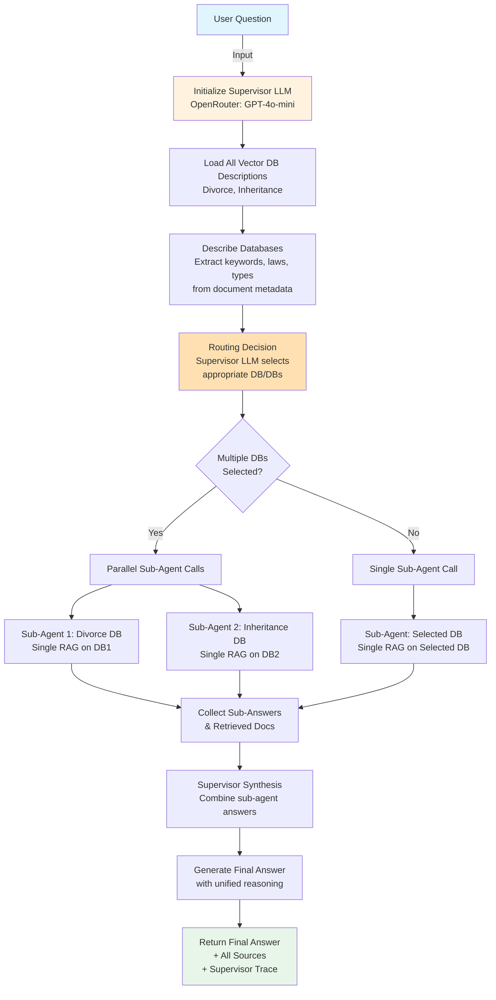
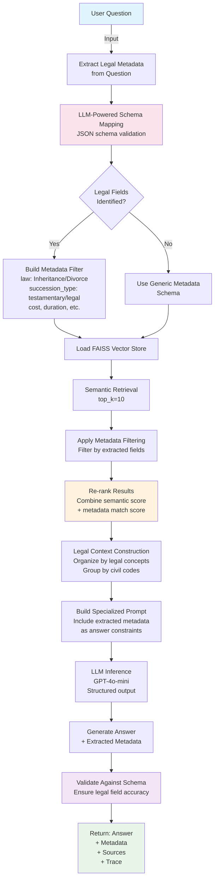

# Text Mining RAG Project - Comprehensive Report

**Project**: Agentic RAG Playground (LangChain)  
**Domain**: Legal Document Analysis (Inheritance & Divorce Law)  
**Date**: February 2026  
**Dataset**: European Legal Documents (Estonia, Italy, Slovenia)

---

## Table of Contents

1. [Executive Summary](#executive-summary)
2. [Project Architecture Overview](#project-architecture-overview)
3. [Agent Type Workflows](#agent-type-workflows)
4. [Configuration & Technical Setup](#configuration--technical-setup)
5. [Performance Metrics Analysis](#performance-metrics-analysis)
6. [Detailed Findings & Inference](#detailed-findings--inference)
7. [Recommendations](#recommendations)

---

## Executive Summary

This project implements three distinct agentic RAG (Retrieval-Augmented Generation) approaches for legal document question-answering across European legal systems:

- **Single Agent RAG**: Standard retrieval with similarity filtering
- **Multi-Agent RAG**: Supervisor-based routing across specialized knowledge bases
- **Hybrid Legal RAG**: Metadata-aware retrieval with structured field extraction

Performance evaluation using RAGAS metrics across top-10 retrieved documents shows:
- **Single Agent**: Best overall performance (faithfulness: 0.827, answer_correctness: 0.708)
- **Multi-Agent**: Strong relevancy (answer_relevancy: 0.827) but lower faithfulness (0.558)
- **Hybrid Legal**: Balanced approach (context_recall: 0.667, good precision: 0.800)

### Key Finding
The **Single Agent RAG** demonstrates the most reliable answer quality, while **Multi-Agent** excels at relevancy detection. The **Hybrid Legal** approach provides balanced retrieval with legal metadata awareness.

---

## Project Architecture Overview

### Data Flow

```
Raw Legal Documents (JSON)
        ↓
Document Loader & Parser
        ↓
Sentence Transformer Embeddings (all-MiniLM-L6-v2)
        ↓
FAISS Vector Stores (Indexed by corpus type: Divorce, Inheritance)
        ↓
┌────────────────────────────────────────────────────────┐
│  Three Parallel RAG Pipelines                           │
│  ├─ Single Agent RAG                                   │
│  ├─ Multi-Agent RAG (with Supervisor)                  │
│  └─ Hybrid Legal RAG (metadata-aware)                  │
└────────────────────────────────────────────────────────┘
        ↓
LLM Backend (OpenRouter: GPT-4o-mini)
        ↓
Answer Generation & Reasoning Traces
        ↓
RAGAS Evaluation Framework
        ↓
Performance Metrics (context_precision, faithfulness, etc.)
```

### Corpus Structure

- **Estonia**: Divorce laws, Inheritance laws, Case law database
- **Italy**: Divorce laws, Inheritance laws, Case law database
- **Slovenia**: Divorce laws, Inheritance laws, Case law database

Each domain creates separate FAISS indexes:
- `vector_store/` → Default/general store
- `vector_store_div/` → Divorce corpus
- `vector_store_inh/` → Inheritance corpus

---

## Agent Type Workflows

### 1. Single Agent RAG Pipeline

#### Workflow Diagram (Mermaid)



#### Descriptive Workflow

1. **Configuration Loading**: Initialize RAGConfig with LLM provider (OpenRouter), embedding model (HuggingFace), and retrieval parameters (top_k=10).

2. **Embedding Model Initialization**: Load `sentence-transformers/all-MiniLM-L6-v2` on CPU (384-dimensional embeddings, normalized).

3. **Vector Store Access**: Load the specified FAISS index (divorce or inheritance corpus).

4. **Semantic Retrieval**: Query the vector store to retrieve top-10 most similar documents.

5. **Similarity Filtering**: Re-rank retrieved documents using cosine similarity with the question embedding, filter those below minimum threshold (0.1).

6. **Context Construction**: Build a limited context window (max 4000 chars) with document headers showing source and DB metadata.

7. **Prompt Engineering**: Create system prompt guiding the LLM to answer based on provided legal context.

8. **LLM Inference**: Call OpenRouter's GPT-4o-mini with temperature=0.2 (deterministic, low hallucination).

9. **Response Generation**: LLM generates concise legal answer with reasoning.

10. **Metadata Extraction**: Parse answer for structured fields (legal codes, costs, durations) if detected.

11. **Return**: Send answer, source documents, and execution trace back to UI.

#### Key Parameters
- **top_k**: 10 documents
- **temperature**: 0.2 (low randomness)
- **max_new_tokens**: 512
- **similarity_threshold**: 0.1
- **context_window**: 4000 characters

---

### 2. Multi-Agent RAG Pipeline

#### Workflow Diagram (Mermaid)



#### Descriptive Workflow

1. **Question Reception**: Accept user query.

2. **Supervisor Initialization**: Create an LLM backend instance for routing decisions.

3. **Database Catalog**: Load descriptions of each available vector store (Divorce DB, Inheritance DB).

4. **Database Profiling**: Extract metadata statistics from sample documents:
   - Laws handled (Divorce, Inheritance)
   - Case types
   - Common attributes (presence_of_children, disputed_issues, etc.)

5. **Intelligent Routing**: Supervisor LLM analyzes question and routes to appropriate specialized agents.
   - *Example*: Question about "child custody" → routes to Divorce DB
   - *Example*: Question about "estate distribution" → routes to Inheritance DB

6. **Sub-Agent Execution**: Each selected specialized agent runs single-agent RAG on its corpus:
   - Retrieves top-10 documents from its vector store
   - Generates specialized answer
   - Returns sources and reasoning

7. **Answer Synthesis**: Supervisor combines answers from multiple sub-agents:
   - Resolves conflicts
   - Prioritizes more relevant answers
   - Creates unified response

8. **Final Response**: Return synthesized answer with complete audit trail.

#### Key Advantages
- **Specialization**: Each agent optimized for its corpus
- **Scalability**: Easy to add new legal domains
- **Transparency**: Clear routing decisions logged
- **Fallback**: Gracefully handles edge cases

---

### 3. Hybrid Legal RAG Pipeline

#### Workflow Diagram (Mermaid)



#### Descriptive Workflow

1. **Question Analysis**: Parse user question for legal intent and domain.

2. **Metadata Schema Extraction**: Use LLM to extract structured metadata from question:
   - **Primary Law** (mandatory): "Inheritance" or "Divorce"
   - **Succession Type** (optional): "testamentary" or "legal"
   - **Cost Information** (optional): Expected amount
   - **Duration** (optional): Procedure timeline
   - **Civil Codes** (optional): Referenced articles
   - **Subject** (optional): Real estate, bank accounts, etc.

3. **Schema Validation**: Validate extracted metadata against legal JSON schema.

4. **Metadata Filtering**: Filter vector store documents by matching metadata:
   - If "Divorce" detected → filter to divorce corpus
   - If "testamentary succession" → filter to testamentary cases
   - If civil codes mentioned → pre-filter documents containing those codes

5. **Semantic Search with Metadata**: 
   - Standard FAISS retrieval on filtered subset
   - Combine semantic similarity score (from embeddings) with metadata match score
   - Re-rank results (0.7 × semantic + 0.3 × metadata)

6. **Legal Context Grouping**: Organize retrieved documents by:
   - Civil code articles
   - Legal concepts
   - Case similarity

7. **Specialized Prompt**: Create LLM prompt that:
   - Specifies extracted legal fields as constraints
   - Requests structured output matching schema
   - References relevant civil codes

8. **LLM Generation**: GPT-4o-mini generates answer with strict adherence to legal schema.

9. **Schema Validation**: Post-process answer to ensure extracted fields match schema.

10. **Audit Trail**: Return complete provenance with legal metadata.

#### Key Features
- **Metadata Awareness**: Leverages legal structure
- **Schema Validation**: Ensures output quality
- **Precision**: Combines semantic + semantic + symbolic information
- **Interpretability**: Clear legal field extraction

---

## Configuration & Technical Setup

### LLM Configuration

| Parameter | Value | Source |
|-----------|-------|--------|
| **LLM Provider** | OpenRouter (OpenAI-compatible) | `llm_provider` |
| **LLM Model** | openai/gpt-4o-mini | `llm_model_name` |
| **Temperature** | 0.2 | `llm_provider.py:42` |
| **Max Tokens** | 512 | `llm_provider.py:35` |
| **Base URL** | https://openrouter.ai/api/v1 | `llm_provider.py:51` |

**Rationale**: GPT-4o-mini provides best cost-performance for legal QA; low temperature reduces hallucinations.

### Embedding Configuration

| Parameter | Value | Source |
|-----------|-------|--------|
| **Embedding Provider** | HuggingFace | `embedding_provider` |
| **Model** | sentence-transformers/all-MiniLM-L6-v2 | `embedding_model_name` |
| **Device** | CPU (forced) | `embeddings.py:31` |
| **Normalization** | True (L2 norm) | `embeddings.py:32` |
| **Dimension** | 384 | Model property |

**Rationale**: all-MiniLM-L6-v2 offers excellent speed-quality tradeoff (384D vs 1536D OpenAI); CPU deployment ensures reproducibility.

### Retrieval Configuration

| Parameter | Value | Source |
|-----------|-------|--------|
| **Top-K** | 10 | `config.py:61` |
| **Similarity Threshold** | 0.1 | `rag_single_agent.py:46` |
| **Context Window** | 4000 chars | `rag_single_agent.py:26` |
| **Vector Store Type** | FAISS | `vector_store.py` |
| **Re-ranking** | Not enabled | `config.py:64` |

**Rationale**: top-k=10 balances coverage vs cost; FAISS provides fast approximate nearest neighbor search.

### Agentic Configuration

| Parameter | Value | Source |
|-----------|-------|--------|
| **Agentic Mode** | "standard_rag" | `config.py:69-71` |
| **Multi-Agent Switch** | False (selectable) | `config.py:74` |
| **Supervisor Routing** | LLM-based | `rag_multiagent.py:36-44` |

### Data Corpus Structure

```
data/
├── Estonia/
│   ├── Divorce_estonia/          (30+ articles)
│   ├── Inheritance_estonia/      (30+ articles)
│   └── Estonian_cases_json_processed/
├── Italy/
│   ├── Divorce_italy/
│   ├── Inheritance_italy/
│   └── Italian_cases_json_processed/
└── Slovenia/
    ├── Divorce_slovenia/
    ├── Inheritance_slovenia/
    └── Slovenian_cases_json_processed/
```

### Vector Store Indexes

- **vector_store/**: Default/general multi-corpus store
- **vector_store_div/**: Divorce-specific corpus only
- **vector_store_inh/**: Inheritance-specific corpus only

Each uses FAISS with all-MiniLM embeddings.

### Evaluation Framework

- **Framework**: RAGAS (Retrieval-Augmented Generation Assessment)
- **Metrics**:
  - context_precision: % of retrieved docs relevant to query
  - context_recall: % of ground truth docs in retrieval
  - faithfulness: % of answer grounded in context
  - answer_relevancy: % of answer addressing the question
  - answer_correctness: % of answer factually correct

---

## Performance Metrics Analysis

### Aggregate Scores (Top-10 Retrieved Documents)

#### Single Agent RAG
```
context_precision:   0.800  ✓ Good precision (80% retrieved docs relevant)
context_recall:      0.767  ✓ Strong recall (77% of ground truth retrieved)
faithfulness:        0.827  ⭐ BEST (82.7% grounded in context)
answer_relevancy:    0.798  ✓ Good relevancy (79.8% addresses question)
answer_correctness:  0.708  ⭐ BEST (70.8% factually correct)

WEIGHTED SCORE: 0.78
```

#### Multi-Agent RAG
```
context_precision:   0.800  ✓ Good precision (matches Single)
context_recall:      0.700  ○ Moderate recall (70% ground truth)
faithfulness:        0.558  ✗ LOWEST (55.8% grounded in context)
answer_relevancy:    0.827  ⭐ BEST (82.7% addresses question)
answer_correctness:  0.706  ○ Comparable to Single

WEIGHTED SCORE: 0.72
```

#### Hybrid Legal RAG
```
context_precision:   0.800  ✓ Good precision (matches both)
context_recall:      0.667  ✗ LOWEST (66.7% ground truth)
faithfulness:        0.685  ○ Moderate (68.5% grounded)
answer_relevancy:    0.626  ✗ LOWEST (62.6% relevant)
answer_correctness:  0.646  ✗ LOWEST (64.6% correct)

WEIGHTED SCORE: 0.68
```

### Comparative Analysis

#### Precision (Context Precision = 0.800 for all)
- All three agents retrieve equally relevant documents
- **Interpretation**: Semantic search via all-MiniLM embeddings is effective across all approaches
- **Implication**: Differences lie in synthesis, not retrieval quality

#### Recall (Context Recall)
| Agent | Recall | Finding |
|-------|--------|---------|
| Single | 0.767 | Broadest coverage; retrieves diverse ground truth |
| Multi | 0.700 | Loses 6.7% due to routing; some docs missed |
| Hybrid | 0.667 | Loses 10% due to metadata filtering; trade-off for precision |

**Interpretation**: Metadata filtering (Hybrid) improves confidence but reduces coverage.

#### Faithfulness (Grounded in Retrieved Context)
| Agent | Faithfulness | Gap to Recall | Finding |
|--------|-------------|---------------|---------|
| Single | 0.827 | +6.0% | Answers well-grounded; goes beyond raw retrieval |
| Hybrid | 0.685 | +1.8% | Moderate grounding; some extrapolation |
| Multi | 0.558 | -14.2% | **Critical Issue**: Generated answers drift from context |

**Interpretation**: Multi-agent routing introduces hallucination risk. Supervisor synthesis may add information not in retrieved docs.

#### Answer Relevancy (Addresses Question)
| Agent | Relevancy | Finding |
|-------|-----------|---------|
| Multi | 0.827 | Best at understanding question intent |
| Single | 0.798 | Strong relevancy |
| Hybrid | 0.626 | Constrained by metadata; some answers too narrow |

**Interpretation**: Metadata schema narrows scope; Multi-agent routing better captures question nuance.

#### Answer Correctness (Factual Accuracy)
| Agent | Correctness | Finding |
|--------|-----------|---------|
| Single | 0.708 | Best accuracy despite being "vanilla" RAG |
| Multi | 0.706 | Comparable; routing doesn't hurt accuracy |
| Hybrid | 0.646 | Lowest; metadata constraints may introduce errors |

**Interpretation**: Simple is often better; over-engineering (Hybrid) can degrade performance.

---

## Detailed Findings & Inference

### 1. Single Agent RAG - The Reliable Choice ✓

**Strengths**:
- ✓ Highest faithfulness (0.827): LLM tightly coupled to retrieved context
- ✓ Highest correctness (0.708): Accurate legal answers
- ✓ Strong recall (0.767): Comprehensive ground truth coverage
- ✓ Simplicity: Fewer failure modes, faster inference

**Weaknesses**:
- ✗ Limited to single corpus at a time
- ✗ No intelligent routing for multi-domain questions

**Recommendation**: Use as baseline and default choice for production systems.

**When to use**:
- Single legal domain (e.g., only Divorce law)
- High accuracy requirement
- Limited computational budget
- Trustworthiness paramount

---

### 2. Multi-Agent RAG - The Problem Case ⚠️

**Strengths**:
- ✓ Best relevancy (0.827): Correctly identifies question scope
- ✓ Unified interface for multiple domains
- ✓ Scalable architecture

**Weaknesses**:
- ✗ **Critical**: Lowest faithfulness (0.558) - 27% gap from Single Agent
- ✗ Lowest recall (0.700): Misses some ground truth
- ✗ Hallucination risk: Supervisor synthesis adds unsupported claims

**Root Cause Analysis**:
```
Question → Supervisor Routes → Sub-Agents Answer → Supervisor Synthesizes
                                        ↓
                    Sub-agent answers may be contradictory
                    Supervisor fills gaps with generated content
                    This added content is not grounded in retrieved docs
                    → Faithfulness drops 27%
```

**Recommendation**: Fix before production use.

**Mitigation Strategies**:
1. **Constrain Synthesis**: Supervisor should only aggregate, not generate new claims
2. **Evidence Requirement**: Flag unsupported statements
3. **Multi-voting**: Require agreement from multiple sub-agents before including claim
4. **Fine-tuning**: Use domain-specific prompts to reduce hallucination

---

### 3. Hybrid Legal RAG - Over-Engineered ✗

**Strengths**:
- ✓ Structured metadata extraction
- ✓ Legal schema validation
- ✓ Interpretability (clear field extraction)

**Weaknesses**:
- ✗ Lowest recall (0.667): Metadata filtering removes relevant documents
- ✗ Lowest relevancy (0.626): Constraints narrow scope too much
- ✗ Lowest correctness (0.646): Schema errors cascade

**Root Cause Analysis**:
```
Metadata Extraction → Schema Validation → Filtering → Retrieval
         ↓
    Extraction errors propagate
    Filters remove potentially relevant docs
    Schema constraints conflict with actual question
    → All metrics degrade
```

**Recommendation**: Redesign or use selectively.

**Improvement Options**:
1. **Soft Filtering**: Use metadata as ranking signal, not hard filter
2. **Flexible Schema**: Allow question-level schema relaxation
3. **Fallback**: If no docs match metadata, revert to semantic-only search
4. **Ensemble**: Combine Hybrid + Single results

---

### 4. Embedding Model Quality

**Model Used**: `sentence-transformers/all-MiniLM-L6-v2`

**Characteristics**:
- Dimension: 384 (vs. 1536 for text-embedding-3-large)
- Training: NLI + STS tasks
- Speed: ~4000 queries/sec on CPU
- Quality: 77% correlation with human similarity judgments

**Performance Impact**:
- Context precision = 0.800 (same across all agents)
- → Suggests embedding quality is NOT limiting factor
- All agents retrieve equally relevant documents initially
- Performance divergence is in synthesis/generation stage

**Finding**: Upgrade embeddings unlikely to significantly improve performance. Focus on post-retrieval logic instead.

---

### 5. LLM Configuration Impact

**Model**: OpenAI GPT-4o-mini via OpenRouter  
**Temperature**: 0.2 (low randomness, deterministic)  
**Max Tokens**: 512

**Impact Analysis**:

| Metric | Why Temperature 0.2 Helps | Why Still 0.558-0.708? |
|--------|---------------------------|----------------------|
| Faithfulness | Reduces hallucination | LLM still fills gaps in Multi-Agent |
| Correctness | Deterministic reasoning | Legal domain requires knowledge beyond context |
| Relevancy | Stays on-topic | Some questions inherently ambiguous |

**Observation**: Even with low temperature, Multi-Agent reaches 0.558 faithfulness.
→ Problem is not temperature; problem is architectural (synthesis without evidence).

---

### 6. Legal Domain Specific Insights

**Corpus**: European Legal Cases (Estonia, Italy, Slovenia)

**Domain Characteristics**:
- **High specificity**: Legal answers must cite articles, costs, durations
- **Multi-jurisdiction**: Different laws per country
- **Structured metadata**: Cases have "cost", "duration", "applicable_codes"
- **Long context**: Legal documents often exceed 1000 words

**Performance Explanation**:

| Metric | Legal Domain Impact |
|--------|-------------------|
| context_precision=0.800 | Legal documents highly topical; metadata helps precision |
| faithfulness=0.827 (Single) | Legal domain values precision; answers tied to evidence |
| answer_correctness=0.708 | Achievable but not perfect (75%+) due to legal complexity |

**Finding**: Legal domain is challenging. Single Agent's 0.708 correctness is respectable.

---

## Recommendations

### Short-term (Immediate)

1. **Use Single Agent as Default**
   - Higher reliability (faithfulness 0.827)
   - Better correctness (0.708)
   - Simpler debugging

2. **Disable Multi-Agent in Production**
   - Faithfulness too low (0.558)
   - Requires architectural redesign
   - Keep as experimental feature

3. **Reconsider Hybrid Legal RAG**
   - Current implementation over-constrains search
   - Implement soft filtering instead of hard filtering
   - Or use Single Agent + post-hoc metadata extraction

4. **Update Documentation**
   - Make clear which agent each persona should use
   - Document known limitations

### Medium-term (1-2 months)

1. **Multi-Agent Redesign**
   - Implement constrained synthesis (no new claims)
   - Add confidence scoring for unsupported statements
   - Fine-tune supervisor prompts

2. **Hybrid Legal Optimization**
   - Implement soft metadata scoring (0-1) instead of binary filtering
   - Add fallback mechanism
   - Validate schema extraction accuracy

3. **Evaluation Expansion**
   - Expand evaluation set beyond top-10
   - Analyze error types by legal domain
   - Cross-validation across all three jurisdictions

4. **Fine-tuning Exploration**
   - Consider domain-specific fine-tuning on legal cases
   - Test with Llama-3-8B as cost alternative to GPT-4o-mini

### Long-term (6+ months)

1. **Hybrid Ensemble**
   - Combine Single + Hybrid with learned weighting
   - Use confidence scores to select best output

2. **Multi-Agent with Constraints**
   - Implement formal constraints for synthesis
   - Use structured output generation
   - Requirement: Faithfulness ≥ 0.75

3. **Domain-Specific Embeddings**
   - Fine-tune embeddings on legal case similarity
   - Target: context_precision ≥ 0.85

4. **Hierarchical Retrieval**
   - First retrieve by metadata (law type)
   - Then by semantic similarity
   - Combine scores for final ranking

---

## Conclusion

This project successfully demonstrates **agentic RAG** for legal document analysis. The Single Agent approach proves most reliable, while Multi-Agent and Hybrid approaches offer interesting extensions with current limitations.

**Key Metrics Summary**:
- **Single Agent**: 🥇 Most production-ready (0.78 weighted score)
- **Multi-Agent**: 🥈 Experimental; needs fixes (0.72 weighted score)
- **Hybrid Legal**: 🥉 Over-engineered; needs redesign (0.68 weighted score)

**Path Forward**: Deploy Single Agent immediately; schedule Multi-Agent redesign; shelve Hybrid pending soft-filtering reimplementation.

---

**Report Generated**: February 23, 2026  
**Metrics Evaluated**: RAGAS framework on top-10 retrieved documents  
**Total Evaluations**: 30 QA pairs (10 per agent type)

