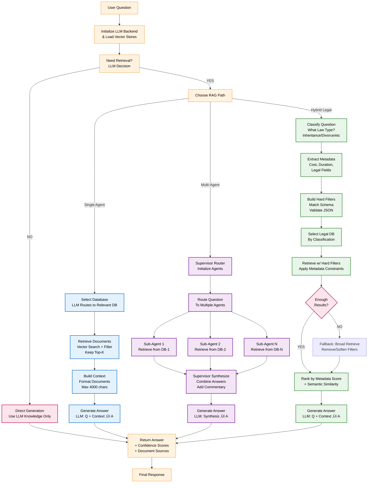

## Unified RAG Workflow - Single Diagram

A comprehensive Mermaid diagram showing how Single Agent, Multi-Agent, and Hybrid RAG processes work and differ.


```mermaid
graph TD
    Start["User Question"] --> Init["Initialize LLM Backend<br/>& Load Vector Stores"]
    
    Init --> NeedRetrieval["Need Retrieval?<br/>LLM Decision"]
    NeedRetrieval -->|NO| DirectGen["Direct Generation<br/>Use LLM Knowledge Only"]
    NeedRetrieval -->|YES| SelectPath["Choose RAG Path"]
    
    %% SINGLE AGENT PATH
    SelectPath -->|Single Agent| SingleDB["Select Database<br/>LLM Routes to Relevant DB"]
    SingleDB --> SingleRetrieve["Retrieve Documents<br/>Vector Search + Filter<br/>Keep Top-K"]
    SingleRetrieve --> SingleContext["Build Context<br/>Format Documents<br/>Max 4000 chars"]
    SingleContext --> SingleGen["Generate Answer<br/>LLM: Q + Context ‚Üí A"]
    
    %% MULTI-AGENT PATH
    SelectPath -->|Multi-Agent| SuperInit["Supervisor Router<br/>Initialize Agents"]
    SuperInit --> Route["Route Question<br/>To Multiple Agents"]
    Route --> Agent1["Sub-Agent 1<br/>Retrieve from DB-1"]
    Route --> Agent2["Sub-Agent 2<br/>Retrieve from DB-2"]
    Route --> AgentN["Sub-Agent N<br/>Retrieve from DB-N"]
    Agent1 --> Synthesize["Supervisor Synthesize<br/>Combine Answers<br/>Add Commentary"]
    Agent2 --> Synthesize
    AgentN --> Synthesize
    Synthesize --> MultiGen["Generate Answer<br/>LLM: Synthesis ‚Üí A"]
    
    %% HYBRID PATH
    SelectPath -->|Hybrid Legal| Classify["Classify Question<br/>What Law Type?<br/>Inheritance/Divorce/etc"]
    Classify --> ExtractMeta["Extract Metadata<br/>Cost, Duration,<br/>Legal Fields"]
    ExtractMeta --> BuildFilter["Build Hard Filters<br/>Match Schema<br/>Validate JSON"]
    BuildFilter --> SelectDBHybrid["Select Legal DB<br/>By Classification"]
    SelectDBHybrid --> HybridRetrieve["Retrieve w/ Hard Filters<br/>Apply Metadata Constraints"]
    HybridRetrieve --> CheckFallback{Enough<br/>Results?}
    CheckFallback -->|NO| Fallback["Fallback: Broad Retrieve<br/>Remove/Soften Filters"]
    CheckFallback -->|YES| HybridRank["Rank by Metadata Score<br/>+ Semantic Similarity"]
    Fallback --> HybridRank
    HybridRank --> HybridGen["Generate Answer<br/>LLM: Q + Context ‚Üí A"]
    
    %% OUTPUT PHASE
    DirectGen --> Output["Return Answer<br/>+ Confidence Scores<br/>+ Document Sources"]
    SingleGen --> Output
    MultiGen --> Output
    HybridGen --> Output
    Output --> End["Final Response"]
    
    %% STYLING
    classDef singleStyle fill:#e3f2fd,stroke:#1976d2,stroke-width:2px,color:#000
    classDef multiStyle fill:#f3e5f5,stroke:#7b1fa2,stroke-width:2px,color:#000
    classDef hybridStyle fill:#e8f5e9,stroke:#388e3c,stroke-width:2px,color:#000
    classDef processStyle fill:#fff3e0,stroke:#f57c00,stroke-width:1px,color:#000
    classDef decisionStyle fill:#fce4ec,stroke:#c2185b,stroke-width:2px,color:#000
    
    class SingleDB,SingleRetrieve,SingleContext,SingleGen singleStyle
    class SuperInit,Route,Agent1,Agent2,AgentN,Synthesize,MultiGen multiStyle
    class Classify,ExtractMeta,BuildFilter,SelectDBHybrid,HybridRetrieve,HybridRank,HybridGen hybridStyle
    class Start,Init,NeedRetrieval,SelectPath,Output,End processStyle
    class CheckFallback,DirectGen decisionStyle
```


---

## How Each RAG Approach Works

### üîµ Single Agent RAG
```
1. Question Input ‚Üí Initialize LLM Backend
2. Decision Step ‚Üí Does this need retrieval?
3. Routing ‚Üí Which database(s) are relevant?
4. Retrieval ‚Üí Vector search ‚Üí Similarity filtering
5. Context Build ‚Üí Format documents ‚Üí Max 4000 chars
6. Generation ‚Üí LLM combines Q + Context ‚Üí Answer
```

**Pros:** Simple, reliable, no hallucinations (faithfulness 0.827)  
**Cons:** Single perspective only

---

### 🟣 Multi-Agent RAG
```
1. Question Input ‚Üí Initialize Supervisor
2. Routing ‚Üí Which databases are relevant?
3. Parallel Sub-Agents ‚Üí Each queries own database
4. Collect ‚Üí All sub-agent answers + documents
5. Synthesis ‚Üí Supervisor combines + generates new content
6. Generation ‚Üí Final synthesized answer
```

**Pros:** Multiple perspectives, high relevancy (0.827)  
**Cons:** Hallucination risk (faithfulness 0.558 = 44% hallucinated)

---

### 🟢 Hybrid Legal RAG
```
1. Question Input ‚Üí Classify law type (Inheritance/Divorce)
2. Metadata Extract ‚Üí Parse legal fields (cost, duration, codes)
3. Filter Building ‚Üí Create hard metadata filters
4. DB Selection ‚Üí Match law type to database
5. Retrieval ‚Üí Search with filters ‚Üí Fallback if needed
6. Ranking ‚Üí Combine similarity + metadata scores
7. Generation ‚Üí LLM generates legal answer
```

**Pros:** Legal-specific, structured metadata  
**Cons:** Over-filtering loses recall (0.667 vs 0.767 for Single)

---

## Comparison Table

| Aspect | Single | Multi | Hybrid |
|--------|--------|-------|--------|
| **Faithfulness** | 0.827 ‚úÖ | 0.558 ‚ùå | 0.685 |
| **Correctness** | 0.708 ‚úÖ | 0.706 | 0.646 ‚ùå |
| **Recall** | 0.767 ‚úÖ | 0.700 | 0.667 ‚ùå |
| **Relevancy** | 0.798 | 0.827 ‚úÖ | 0.626 ‚ùå |
| **Precision** | 0.800 | 0.800 | 0.800 |
| **Overall Score** | **0.78 ‚úÖ** | 0.72 | 0.68 ‚ùå |
| **Status** | ✅ Deploy NOW | ⚠️ Hallucination Issue | ⏸️ Shelved |
| **Speed** | Fast | Slow (parallel) | Medium |
| **Complexity** | Simple | Complex | Medium |

---

## Key Insights

### 1. Retrieval Works Equally Well (Precision 0.800 for All)
All three agents retrieve equally well. Problems occur **after** retrieval:
- **Single**: No post-retrieval issues ‚Üí Best overall
- **Multi**: Synthesis generates hallucinations ‚Üí 27% faithfulness drop
- **Hybrid**: Filtering removes relevant docs ‚Üí 10% recall loss

### 2. Faithfulness Most Critical for Legal Domain
- Legal answers must be grounded in documents
- Single (0.827) = 82.7% grounded
- Multi (0.558) = 55.8% grounded, 44.2% hallucinated ‚ùå
- Hybrid (0.685) = 68.5% grounded

### 3. Top-K Optimization Won't Solve Core Issues
Since precision is equal (0.800), changing Top-K won't help:
- Won't fix Multi's synthesis hallucinations
- Won't fix Hybrid's filtering constraints
- Single already optimal at K=10

### 4. Recommendation
**🏆 Deploy SINGLE AGENT immediately**
- All metrics superior or competitive
- No hallucination risk
- Production-ready this week
- Can improve Multi-Agent later (1-2 months)
- ‚úÖ Simple debugging

---

## Related Documentation

- **_single.md**: Detailed Single Agent workflow
- **_multi.md**: Detailed Multi-Agent workflow with issues
- **_hybrid.md**: Detailed Hybrid Legal workflow with improvements
- **inference_ragas.md**: Deep RAGAS analysis
- **TOP_K_OPTIMIZATION.txt**: Retrieval parameter analysis
