# Single Agent RAG Workflow

## Architecture Overview
The Single Agent RAG implements a **ReAct-style (Reasoning + Acting)** pipeline that processes user questions through a linear sequence of decision points and retrieval operations.

---

## Mermaid Workflow Diagram

```mermaid
graph TD
    A["📥 User Question"] --> B["🤔 Decide: Need Retrieval?<br/>LLM Classification"]
    B -->|NO| C["💭 Use Internal Knowledge<br/>No Retrieval Needed"]
    B -->|YES| D["🗺️ Get Available Databases<br/>Vector Store Directories"]
    D --> E["📊 Build DB Descriptions<br/>Analyze Content Metadata"]
    E --> F["🎯 Select Databases<br/>LLM-based DB Routing"]
    F --> G["🔍 Retrieve from Selected DBs<br/>Vector Similarity Search<br/>k_base = top_k × 3"]
    G --> H["⚖️ Similarity Rank & Filter<br/>Cosine Similarity Score<br/>Min Threshold = 0.1"]
    H --> I["✂️ Keep Top-K Documents<br/>Final Reranking"]
    I --> J["📝 Build Context Window<br/>4000 Character Limit<br/>Format with Source Metadata"]
    J --> K["📚 Combine: Question + Context"]
    K --> L["🧠 Generate Answer<br/>LLM Chat Completion<br/>Temperature = 0.2"]
    C --> L
    L --> M["✅ Final Answer"]
    M --> N["📋 Optional: Reasoning Trace<br/>Show Thought/Action/Observation<br/>Include Retrieval Logs"]
    N --> O["📤 Return Answer + Documents<br/>+ Optional Reasoning"]
    
    style A fill:#e1f5ff
    style M fill:#c8e6c9
    style O fill:#c8e6c9
    style L fill:#fff9c4
    style H fill:#ffccbc
    style G fill:#ffccbc
```



---

## Chronological Workflow Explanation

| Step | Phase | Component | Action | Input | Output | Decision Point |
|------|-------|-----------|--------|-------|--------|-----------------|
| 1 | THOUGHT | Retrieval Classifier | LLM decides if external docs needed | Question | Boolean (YES/NO) | If NO → Use internal knowledge only |
| 2 | ACTION | DB Discovery | Load vector store directory paths | Config (vector_store_dirs) | db_map {db_name → path} | Map empty? → Use defaults |
| 3 | ACTION | DB Analysis | Extract & describe database content | Vector stores with metadata | db_descriptions {db_name → desc} | Cache or regenerate |
| 4 | ACTION | DB Routing | LLM selects relevant databases | Question + db_descriptions | List of chosen_db_names | If empty → Use all DBs |
| 5 | ACTION | Vector Retrieval | Semantic search in selected DBs | Question + embeddings | raw_docs (k_base × 3) | If 0 docs → Fallback |
| 6 | OBSERVATION | Similarity Filtering | Rank by cosine similarity | raw_docs + question embedding | filtered_docs (top_k) | If 0 after filter → Empty context |
| 7 | OBSERVATION | Context Building | Format documents into prompt context | filtered_docs + metadata | context_string (≤4000 chars) | Empty context → Use question only |
| 8 | ANSWER | LLM Generation | Generate answer with context | system_prompt + user_prompt | final_answer | Answer quality depends on context |
| 9 | OBSERVATION | Optional Trace | Build ReAct trace if show_reasoning=true | All intermediate logs | reasoning_trace | Skip if show_reasoning=false |
| 10 | RETURN | Output Pipeline | Package results | answer + documents + trace | Tuple[str, List[Document], Optional[str]] | Return to application |

---

## Key Components Explained

### Component 1: Retrieval Decision
- **Purpose**: Avoid unnecessary retrieval for questions answerable from general knowledge
- **Method**: LLM classification with "YES" or "NO" keywords
- **Output**: Boolean flag controls entire retrieval pipeline
- **Example**: General knowledge Q → NO retrieval; Specific legal Q → YES retrieval

### Component 2: Database Discovery & Description
- **Purpose**: Identify available vector stores and their content
- **Method**: Load db_map from config, analyze metadata from first 20 docs
- **Extraction**: Law type (Inheritance/Divorce), document categories, specialization
- **Output**: Human-readable descriptions for LLM routing decision

### Component 3: Intelligent DB Routing
- **Purpose**: Select most relevant databases to reduce retrieval noise
- **Method**: LLM evaluates question against database descriptions
- **Fallback**: If no DBs selected, use all databases
- **Benefit**: Reduces false positives from irrelevant databases

### Component 4: Vector Semantic Search
- **Purpose**: Find semantically similar documents via embeddings
- **Model**: sentence-transformers/all-MiniLM-L6-v2 (384D vectors, CPU)
- **Search Strategy**: Retrieve k_base (top_k × 3) candidates for filtering
- **Metric**: Cosine similarity via FAISS index

### Component 5: Similarity Ranking & Threshold Filtering
- **Purpose**: Rank by relevance and remove low-quality matches
- **Threshold**: Minimum cosine similarity = 0.1 (configurable)
- **Statistics Logged**: Min/Max/Mean similarity scores
- **Output**: Top-K documents sorted by relevance

### Component 6: Context Window Management
- **Purpose**: Format documents into LLM prompt without exceeding limits
- **Format**: [DOC N | DB: name | source: file] + content
- **Limit**: 4000 characters (default, configurable)
- **Strategy**: Add docs sequentially until limit reached

### Component 7: LLM Answer Generation
- **System Prompt**: Instructs model to use context as primary truth
- **User Prompt**: Question + optional context + instruction for final answer
- **Model**: GPT-4o-mini via OpenRouter (temperature=0.2 for determinism)
- **Output**: Natural language answer

### Component 8: ReAct-Style Reasoning Trace (Optional)
- **Sections**:
  - **Thought**: Whether retrieval was needed
  - **Action**: Which databases were queried
  - **Observation**: What documents were retrieved and why useful
  - **Logs**: Detailed retrieval statistics and filtering info
  - **Config**: Full agent/database configuration for audit trail
- **Usage**: Transparency, debugging, evaluation

---

## Data Flow Diagram

```
User Question
    ↓
    ├─→ [Retrieval Decision LLM]
    │   ├─→ YES: Proceed to retrieval
    │   └─→ NO: Use internal knowledge
    │
    ├─→ [DB Discovery]
    │   └─→ {db1: path1, db2: path2, ...}
    │
    ├─→ [DB Description]
    │   └─→ {db1: "Inheritance law articles", db2: "Divorce cases", ...}
    │
    ├─→ [LLM Routing]
    │   └─→ [db1, db2] (selected databases)
    │
    ├─→ [Vector Search × N databases]
    │   └─→ raw_docs = [doc1, doc2, ..., doc30] (3×top_k)
    │
    ├─→ [Similarity Filter]
    │   ├─→ Score: [0.95, 0.82, 0.45, 0.08, ...]
    │   ├─→ Filter: Keep ≥ 0.1 threshold
    │   └─→ Top-K: [doc1(0.95), doc2(0.82), doc3(0.45)]
    │
    ├─→ [Context Building]
    │   └─→ "[DOC 1|source:file1.pdf]\ncontent...\n[DOC 2|...]"
    │
    └─→ [LLM Answer Generation]
        └─→ Final Answer with References
```

---

## Configuration Parameters

| Parameter | Default | Purpose |
|-----------|---------|---------|
| `top_k` | 10 | Number of final documents to include in context |
| `min_similarity` | 0.1 | Cosine similarity threshold for filtering |
| `context_max_chars` | 4000 | Maximum characters for context window |
| `temperature` | 0.2 | LLM temperature (low = deterministic) |
| `max_tokens` | 512 | Maximum LLM output tokens |
| `agentic_mode` | "react" | Reasoning style (react or basic) |

---

## Example Execution Flow

### Scenario: Legal Question about Inheritance

**Input**: "What documents are required for testamentary succession in Italy?"

| Step | Action | Intermediate Result |
|------|--------|---------------------|
| 1 | Retrieval Classification | **YES** - Legal-specific question needs documents |
| 2 | DB Discovery | {general_rag, divorce_cases, inheritance_cases} |
| 3 | DB Analysis | {general_rag: "general articles", inheritance_cases: "succession law"} |
| 4 | DB Routing | **Selected**: inheritance_cases (highest match score) |
| 5 | Vector Search | **Retrieved**: 30 inheritance articles (k=3×10) |
| 6 | Similarity Filter | **Kept**: 7 articles (scores: 0.92, 0.88, 0.85, 0.78, 0.75, 0.72, 0.65) |
| 7 | Context Building | **Context**: 4000 chars of top articles with sources |
| 8 | Answer Generation | "Italian testamentary succession requires... [based on Art. 536, 537, 539]" |
| 9 | Optional Trace | Full ReAct trace showing thought→action→observation |

---

## Performance Metrics

| Metric | Value | Meaning |
|--------|-------|---------|
| **Context Precision** | 0.800 | 80% of retrieved docs are relevant |
| **Context Recall** | 0.767 | Retrieval captures 76.7% of relevant docs |
| **Faithfulness** | 0.827 | 82.7% of answer grounded in documents |
| **Answer Relevancy** | 0.798 | Answer addresses 79.8% of question scope |
| **Answer Correctness** | 0.708 | 70.8% of answers factually correct |
| **Overall Score** | 0.78 | Best performing agent architecture |

---

## Error Handling & Fallbacks

| Scenario | Detection | Fallback |
|----------|-----------|----------|
| No documents retrieved | len(docs) == 0 | Generate answer from internal knowledge |
| All docs filtered out | After similarity threshold | Use best doc regardless of threshold |
| No database selected | len(chosen_db_names) == 0 | Use all available databases |
| Retrieval disabled | need_retrieval == False | Direct LLM inference mode |
| Context exceeds limit | context_chars > 4000 | Truncate at 4000 chars |

---

## Advantages of Single Agent

✅ **Linear Architecture** - No complex synthesis layer  
✅ **High Faithfulness** - 0.827 (documents are primary truth)  
✅ **High Correctness** - 0.708 (most accurate answers)  
✅ **Simple Debugging** - Clear trace of each step  
✅ **Production Ready** - No hallucination risk from synthesis  
✅ **Fast Execution** - Single-pass retrieval + generation  

---

## Limitations

⚠️ **Single Database Focus** - May miss cross-domain knowledge  
⚠️ **No Multi-routing** - Cannot iteratively refine queries  
⚠️ **Limited Reasoning** - No supervisor for complex questions  
⚠️ **Database Selection** - Quality depends on LLM routing accuracy  

---

## Related Workflows
- **Multi-Agent RAG**: Uses supervisor for multi-database synthesis
- **Hybrid Legal RAG**: Adds metadata filtering and law classification
- **Full RAG Workflow**: Combined diagram showing all three approaches
