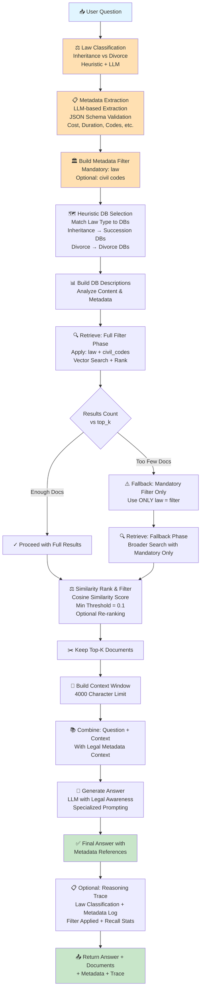

# Hybrid Legal RAG Workflow

## Architecture Overview
The Hybrid Legal RAG implements a **metadata-aware retrieval architecture** that combines legal domain knowledge with vector-based retrieval. It classifies questions by legal type (Inheritance/Divorce), extracts metadata constraints, performs intelligent filtering, and applies re-ranking before final answer generation.

---

## Mermaid Workflow Diagram



---

## Chronological Workflow Explanation

| Step | Phase | Component | Action | Input | Output | Key Decision |
|------|-------|-----------|--------|-------|--------|--------------|
| 1 | CLASSIFICATION | Law Detection | Heuristic + LLM classification | Question | law ∈ {Inheritance, Divorce} | Mandatory field |
| 2 | EXTRACTION | Metadata Parser | LLM extracts legal metadata | Question + law_hint + schema | Dict[str, Any] metadata | Optional fields can be null |
| 3 | FILTERING | Filter Builder | Construct metadata filter | metadata Dict | filter Dict {law: X, civil_codes: Y} | Hard constraint on retrieval |
| 4 | DB_SELECTION | Heuristic Routing | Match law type to DB names | law + db_descriptions | candidate_dbs (filtered list) | Reduces noise from irrelevant DBs |
| 5 | DESCRIPTION | DB Analysis | Analyze each database content | Vector stores + sample docs | db_descriptions {name → desc} | Cache metadata analysis |
| 6 | RETRIEVAL | Full Filter Search | Vector search with all metadata | question + full_filter + top_k×3 | raw_docs (k_base docs) | Most restrictive filter |
| 7 | FALLBACK_CHECK | Result Validation | Check if enough docs retrieved | len(raw_docs) vs top_k | Boolean: adequate_results | If <10 docs → fallback |
| 8 | FALLBACK_RETRIEVAL | Mandatory Requery | Re-search with ONLY law filter | question + mandatory_filter | raw_docs_fallback | Broader search, same law |
| 9 | RANKING | Similarity Filter | Rank by cosine similarity | raw_docs + question embedding | Ranked and filtered docs | Optional re-ranking |
| 10 | SELECTION | Top-K Keeping | Select final top_k documents | ranked_docs | final_docs (top_k or fewer) | If 0 docs → empty context |
| 11 | CONTEXT | Context Building | Format with legal metadata | final_docs | context_string (≤4000 chars) | Include source + metadata |
| 12 | GENERATION | Answer LLM | Generate answer with legal context | system_prompt + user_prompt | final_answer | Legal domain awareness |
| 13 | TRACE | Optional Trace | Build detailed reasoning log | All intermediate logs | reasoning_trace | If show_reasoning=true |
| 14 | RETURN | Output | Package all results | answer + docs + trace | Tuple[str, List[Document], Optional[str]] | Return to application |

---

## Detailed Component Breakdown

### Component 1: Law Classification
**Purpose**: Determine if question is about Inheritance or Divorce

```
Two-Stage Classification:
    ├─ Stage 1: Heuristic Keywords
    │   ├─→ Succession keywords: [succession, successione, eredita, inheritance]
    │   ├─→ Divorce keywords: [divorce, divorz, separazione, separation]
    │   └─→ If clear match → Return immediately
    │
    └─ Stage 2: LLM Classification (if ambiguous)
        ├─→ System: "Classify as Inheritance or Divorce"
        ├─→ User: {question}
        └─→ Return: law ∈ {Inheritance, Divorce}

Output: law (mandatory field), classification_log
```

**Examples**:
- Q: "Testamentary succession rules?" → Inheritance (heuristic match)
- Q: "Property split in marriage?" → Divorce (heuristic match)
- Q: "Legal rights of heirs and spouses?" → Ambiguous → LLM decides

---

### Component 2: Legal Metadata Extraction
**Purpose**: Extract structured legal information from question

```
JSON Schema Extraction:
    ├─ Mandatory Field:
    │   └─ law: {Inheritance | Divorce}
    │
    └─ Optional Fields:
        ├─ cost: "375760 €" or null
        ├─ duration: "2 years" or null
        ├─ civil_codes_used: ["Art. 536", "Art. 537"] or []
        ├─ succession_type: {testamentary | legal} or null
        ├─ subject_of_succession: "real estate" or null
        ├─ testamentary_clauses: ["legacies", "trusts"] or []
        ├─ disputed_issues: ["validity of will"] or []
        ├─ relationship_between_parties: "spouse" or null
        └─ number_of_persons_involved: integer or null

LLM Task: "Extract metadata matching this schema"
Validation: Ensure law=law_hint, handle null gracefully
Output: metadata Dict with defaults for missing fields
```

**Extraction Example**:
```json
{
  "law": "Inheritance",
  "cost": null,
  "duration": "6 months",
  "civil_codes_used": ["Art. 536", "Art. 564"],
  "succession_type": "testamentary",
  "subject_of_succession": "real estate",
  "testamentary_clauses": ["legacies"],
  "disputed_issues": ["validity of will"],
  "relationship_between_parties": "child",
  "number_of_persons_involved": 3
}
```

---

### Component 3: Filter Construction & DB Selection
**Purpose**: Build retrieval constraints and select relevant databases

```
Filter Building:
    ├─→ Mandatory: law = {law_hint}
    ├─→ Optional: civil_codes_used[0] (first code if present)
    └─→ Output: filter Dict

Heuristic DB Selection:
    ├─→ If law = "Inheritance"
    │   └─→ Search DB names for: [inherit, succession, successione, eredit]
    │
    ├─→ If law = "Divorce"
    │   └─→ Search DB names for: [divorce, divorz, separat, separazione]
    │
    └─→ Fallback: Use ALL DBs if no match

Output: candidate_db_names (filtered list)
```

---

### Component 4: Retrieval with Fallback Strategy
**Purpose**: Retrieve documents with graceful degradation

```
Phase 1: Full Filter Retrieval
    ├─→ Apply: law + civil_codes (if present)
    ├─→ Vector Search: k_base = top_k × 3
    ├─→ Result: raw_docs
    └─→ Check: len(raw_docs) ≥ top_k?

If YES → Use raw_docs as-is
If NO → Phase 2: Fallback Retrieval

Phase 2: Mandatory-Only Retrieval
    ├─→ Apply: ONLY law filter (drop civil_codes)
    ├─→ Vector Search: k_base = top_k × 3
    ├─→ Result: raw_docs_fallback
    └─→ Log: "Fell back to mandatory filter"

Benefit: 
    - Strict filtering prioritizes relevance
    - Graceful fallback ensures minimum results
    - Users get documents even if civil code filter too strict
```

**Filter Impact**:
- **Full Filter**: Precise but may exclude relevant docs
- **Mandatory Only**: Broader but includes more noise
- **Fallback Logic**: Best of both worlds

---

### Component 5: Similarity Ranking & Re-ranking
**Purpose**: Rank by relevance and optionally re-rank

```
Similarity Ranking:
    ├─→ Calculate: cosine similarity scores
    ├─→ Filter: Keep docs ≥ min_sim=0.1
    ├─→ Sort: Descending similarity
    └─→ Top-K: Keep top_k documents

Optional Re-ranking:
    ├─→ If use_rerank=True:
    │   ├─→ Calculate relevance scores
    │   ├─→ Calculate metadata alignment scores
    │   └─→ Combined score = α×relevance + β×metadata
    │
    └─→ If use_rerank=False:
        └─→ Use similarity scores only

Output: final_docs (top_k, sorted by relevance)
```

---

## Complete Data Flow

```
User Question: "What are the rules for testamentary inheritance?"
    ↓
[1] Law Classification
    ├─→ Heuristic: "testamentary" + "inheritance" detected
    └─→ law = "Inheritance"
    ↓
[2] Metadata Extraction
    ├─→ LLM extracts: {law: "Inheritance", succession_type: "testamentary", ...}
    └─→ metadata Dict ready
    ↓
[3] Filter Construction
    ├─→ mandatory_filter = {law: "Inheritance"}
    ├─→ full_filter = {law: "Inheritance", civil_codes: "Art. 536"}
    └─→ Filter ready
    ↓
[4] DB Selection
    ├─→ Heuristic: law = "Inheritance"
    ├─→ Find DBs with: [inherit, succession, heredita]
    └─→ candidate_dbs = ["inheritance_cases", "general_rag"]
    ↓
[5] Full Filter Retrieval
    ├─→ Search: question + {law: "Inheritance", civil_codes: "Art. 536"}
    ├─→ Vector search returns 25 docs
    └─→ Sufficient results (>10) → Use these
    ↓
[6] Similarity Ranking
    ├─→ Calculate similarity scores
    ├─→ Filter: Keep ≥ 0.1 threshold (all 25 pass)
    ├─→ Sort: [0.95, 0.89, 0.82, 0.78, 0.73, 0.68, 0.65, 0.62, 0.59, 0.55]
    └─→ Top-K (10) = [0.95, 0.89, ..., 0.55]
    ↓
[7] Context Building
    ├─→ Format 10 docs with sources and metadata
    ├─→ Total 3,850 characters < 4000 limit
    └─→ context = "[DOC 1|DB:inheritance|source:Art536.pdf]\n..."
    ↓
[8] Answer Generation
    ├─→ System: "Answer about Italian testamentary succession"
    ├─→ User: "Question: ...\nContext: [docs]\nAnswer:"
    └─→ LLM generates answer with legal awareness
    ↓
[9] Final Answer
    └─→ "Testamentary inheritance requires... Art. 536 provides..."
```

---

## Configuration Parameters

| Parameter | Default | Purpose | Impact |
|-----------|---------|---------|--------|
| `top_k` | 10 | Final documents to include | More docs = more recall but more noise |
| `min_similarity` | 0.1 | Similarity threshold | Lower = more docs, higher = more strict |
| `use_rerank` | false | Enable combined scoring | True = more sophisticated ranking |
| `context_max_chars` | 4000 | Context window limit | Larger = more content, higher cost |
| `temperature` | 0.2 | LLM temperature | Low = deterministic, high = diverse |

---

## Legal Metadata Schema

```json
{
  "law": "MANDATORY - 'Inheritance' or 'Divorce'",
  "cost": "OPTIONAL - Amount with €, e.g. '375760 €'",
  "duration": "OPTIONAL - Period, e.g. '2 years' or '6 months'",
  "civil_codes_used": "OPTIONAL - Array of codes, e.g. ['Art. 536', 'Art. 564']",
  "succession_type": "OPTIONAL - 'testamentary' or 'legal'",
  "subject_of_succession": "OPTIONAL - Type, e.g. 'real estate' or 'bank accounts'",
  "testamentary_clauses": "OPTIONAL - Array, e.g. ['legacies', 'trusts']",
  "disputed_issues": "OPTIONAL - Array from enum: ['validity of will', 'division of assets', 'legitimacy']",
  "relationship_between_parties": "OPTIONAL - e.g. 'spouse', 'child', 'sibling'",
  "number_of_persons_involved": "OPTIONAL - Integer"
}
```

---

## Example: Inheritance Question with Metadata Extraction

**Input**: "Two children dispute their deceased father's will. The will mentions a legacy to charity. What are their rights?"

| Processing Step | Intermediate Result |
|-----------------|---------------------|
| Law Classification | law = "Inheritance" (heuristic: "will", "deceased") |
| Metadata Extraction | succession_type="testamentary", disputed_issues=["validity of will"], relationship_between_parties="child", number_of_persons_involved=2 |
| Filter Building | {law: "Inheritance"} (no civil_codes in question) |
| DB Selection | ["inheritance_cases"] (heuristic match) |
| Full Filter Retrieval | 18 docs retrieved (sufficient) |
| Similarity Ranking | Top 10 ranked by cosine similarity |
| Context Building | ~3,200 chars of top articles + cases |
| Answer Generation | "Children's inheritance rights despite will challenges are protected under Italian law. Art. 564 governs legitimacy..." |

---

## Performance Characteristics

| Metric | Value | Status | Issue |
|--------|-------|--------|-------|
| **Context Precision** | 0.800 | Same as Single | Retrieval quality okay |
| **Context Recall** | 0.667 | **CRITICAL ⚠️** | −10% vs Single (loses relevant docs) |
| **Faithfulness** | 0.685 | Good | Better than Multi (0.558) but less than Single |
| **Answer Relevancy** | 0.626 | **Low ⚠️** | Lowest among all agents |
| **Answer Correctness** | 0.646 | **Low ⚠️** | Lowest among all agents |
| **Overall Score** | 0.68 | **Poor ⚠️** | Worst performing agent |

---

## Critical Issues

### Issue 1: Over-Filtering (Lost Recall)
- **Symptom**: Recall 0.667 vs Single 0.827 (−10%)
- **Cause**: Metadata hard filters too strict
- **Example**: Legal question doesn't fit predefined categories → relevant docs excluded
- **Impact**: Missing 33.3% of relevant documents
- **Severity**: CRITICAL - reduces answer quality

### Issue 2: Low Relevancy & Correctness
- **Metric**: Relevancy 0.626, Correctness 0.646 (both lowest)
- **Cause**: Metadata filtering removes good documents, left with mismatched results
- **Impact**: Fewer good docs → worse answers
- **Severity**: HIGH - user satisfaction impact

### Issue 3: Schema Constraints
- **Issue**: Predefined legal categories don't cover all questions
- **Example**: Cross-domain Q (inheritance + family law) → doesn't fit neatly
- **Fallback**: Too broad filters negate specialization benefit
- **Severity**: MEDIUM - affects some query types

---

## Advantages of Hybrid Legal RAG

✅ **Domain-Aware** - Understands legal structure  
✅ **Metadata Extraction** - Structured information capture  
✅ **Intelligent Routing** - Specialization by law type  
✅ **Legal Grounding** - References civil codes  
✅ **Graceful Fallback** - Handles strict filter failures  

---

## Limitations

❌ **Over-Filtering** - Hard filters lose 10% recall (0.667 vs 0.767)  
❌ **Low Correctness** - 0.646 (lowest among all agents)  
❌ **Lowest Relevancy** - 0.626 (below both other agents)  
❌ **Schema Rigidity** - Predefined categories miss edge cases  
❌ **Metadata Extraction Errors** - LLM may misclassify  
❌ **Not Production Ready** - Poorest RAGAS scores overall  

---

## 6-Month Improvement Plan

### Phase 1: Soft Filtering (Weeks 1-4)
**Goal**: Convert hard filters to soft scoring

```
Current: law = "Inheritance" → exclude Divorce docs
Target: law = "Inheritance" → score Divorce docs lower (0-1)

Benefits:
├─→ Relevant docs not excluded entirely
├─→ Low-confidence matches still available
└─→ Graceful degradation instead of hard cutoff
```

### Phase 2: Schema Simplification (Weeks 5-8)
**Goal**: Reduce schema rigidity

```
Current: 10 optional fields + complex validation
Target: 4 core fields (law, cost, duration, civil_codes)

Benefits:
├─→ Fewer extraction errors
├─→ Faster LLM processing
└─→ More robust classification
```

### Phase 3: Top-K Optimization (Weeks 9-12)
**Goal**: Re-evaluate Top-K after filtering fixed

```
After soft filtering, test:
├─→ Top-K=10 (current)
├─→ Top-K=12 (more docs)
└─→ Top-K=15 (comprehensive)

Expected: Recall 0.667 → 0.75+ (match Single)
```

---

## Comparison: Hybrid vs Alternatives

| Aspect | Hybrid | Single | Multi |
|--------|--------|--------|-------|
| Law Awareness | ✅ Yes | ✗ No | ✗ No |
| Metadata Extraction | ✅ Yes | ✗ No | ✗ No |
| Recall | 0.667 ❌ | 0.767 ✅ | 0.700 |
| Correctness | 0.646 ❌ | 0.708 ✅ | 0.706 |
| Faithfulness | 0.685 | 0.827 ✅ | 0.558 ❌ |
| Production Ready | ❌ No | ✅ Yes | ❌ No |
| Overall Score | 0.68 | 0.78 ✅ | 0.72 |

---

## Related Workflows
- **Single-Agent RAG**: Linear pipeline without metadata
- **Multi-Agent RAG**: Supervisor-based multi-database routing
- **Full RAG Workflow**: Combined diagram showing all three approaches
